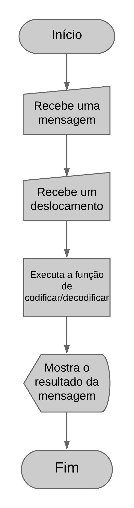

# Cifra de César

## Prefácio

O aniversário da sua mãe está se aproximando e você está organizando uma festa
surpresa. Para manter a festa em segredo foi criado um grupo de Whatsapp com
amigxs e familiares. O problema é que as vezes sua mãe utiliza o seu celular
e pode ser que ela veja as suas mensagens. Como a festa é surpresa, você
decide criar uma aplicação que permita enviar mensagens criptografadas e depois
descriptografar.

## O que é 

A [cifra de César](https://pt.wikipedia.org/wiki/Cifra_de_C%C3%A9sar) é um dos
primeiros tipos de criptografias conhecidos na história. É um tipo de cifra por
substituição, em que uma letra no texto original é substituída por outra,
seguindo um número fixo para essa subtituição.

O imperador Júlio César usou essa cifra para enviar ordens aos seus generais no
campo de batalha. Essa é uma das técnicas mais simples e mais usadas para
cifrar mensagens.

Por exemplo se usarmos o deslocamento de 3:

* Alfabeto sem cifrar: A B C D E F G H I J K L M N O P Q R S T U V W X Y Z
* Alfabeto com cifra:  D E F G H I J K L M N O P Q R S T U V W X Y Z A B C

## Como usar

Para Cifrar uma mensagem, basta esvrevê-la no campo de mensagem, escolher um deslocamento, e clicar no botão "Cifrar". Por Exemplo: "festa surpresa", com deslocamento 3, retorna: "ihvwd vxusuhvd".
E para decifrar uma mensagem, basta escrevê-la no mesmo campo e clicar no botão "Decifrar". Por exemplo: "ihvwd vxusuhvd", com deslocamento 3, retorna "festa surpresa". Clicando no botão "Voltar" a primeira tela reaparece, dando as opções novamente. É possível escolher qualquer número como deslocamento, inclusive números negativos. Espaço, acentos, símbolos e caracteres especias como "& % $ # ^ :  " não são decifrados, aparecendo da mesma forma como foram inseridos na mensagem.

## Como Funciona

O usuário escreve uma mensagem, e escolhe um deslocamento. A função cipherEncrypt faz a cifragem da mesma e a devolve numa segunda tela. Da mesma forma, se quiser decifrar a mensagem, o usuário deve escrevê-la e escolher um número de deslocamento. A função encarregada é a cipherDecrypt, que devolve a mensagem decifrada. Existe um botão para voltar ao início e inserir novas mensagens. 

